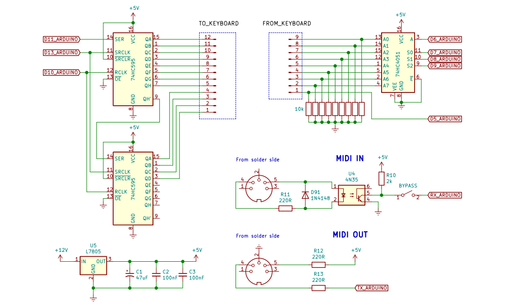
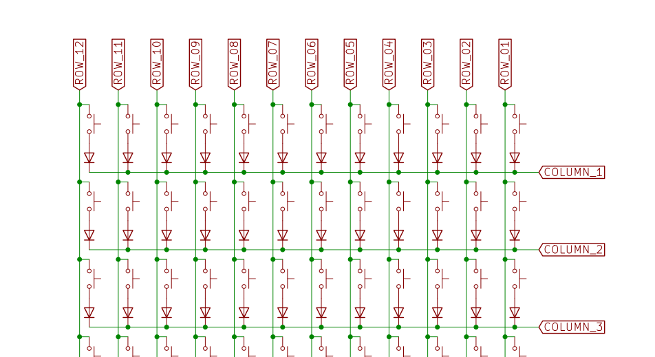

<!-- # Minimoog clone

Improved code for Arduino Nano inside my Minimoog Clone.

Official website: https://www.sebastiansaner.ch/p/minimoog_clone

Image showing circuits around arduino nano

image showing example keyboard matrix inside old salvaged midi keyboard

# Setup
* Install PlatformIO in vscode
*  -->

# Minimoog Clone

This repository contains improved code for the Arduino Nano used in my custom-built Minimoog clone. The goal of this project is to recreate the functionality and feel of the classic Minimoog synthesizer using modern DIY techniques and salvaged components.

**Official project page:** [https://www.sebastiansaner.ch/p/minimoog_clone](https://www.sebastiansaner.ch/p/minimoog_clone)

## Circuits

### Arduino Nano Circuit Integration  
This image shows the central control board, where the Arduino Nano is wired into the surrounding analog and digital components:  

<!--  -->

### Salvaged MIDI Keyboard Matrix  
Part of the schematic of the salvaged MIDI keyboard button matrix.

## Setup

1. Install [PlatformIO](https://platformio.org/) in Visual Studio Code.
2. Clone this repository and open it in VS Code.
3. Use PlatformIO to upload the code to your Arduino Nano.
4. Connect the hardware and power it up.